# Procesverslag
Markdown is een simpele manier om HTML te schrijven.  
Markdown cheat cheet: [Hulp bij het schrijven van Markdown](https://github.com/adam-p/markdown-here/wiki/Markdown-Cheatsheet).

Nb. De standaardstructuur en de spartaanse opmaak van de README.md zijn helemaal prima. Het gaat om de inhoud van je procesverslag. Besteedt de tijd voor pracht en praal aan je website.

Nb. Door *open* toe te voegen aan een *details* element kun je deze standaard open zetten. Fijn om dat steeds voor de relevante stuk(ken) te doen.

## Jij

uitwerken voor kick-off werkgroep

### Auteur:
Gloria Kwako 

#### Je startniveau:
Blauwe piste 🗻

#### Je focus:
surface 🕹 🧩
 

## Je website

uitwerken voor kick-off werkgroep

### Je opdracht:
Voor deze opdracht ga ik de bekendste museum "de Louvre" na maken omdat ik afgelopen zomer hier geweest ben en een super leuke tijd had gehad. De reden waarom deze museum mij aansprak is door de Mona Lisa, wat ik al een tijdje wilde gaan zien. De website heeft een mooie layout waar ik goed mee kan werken en heeft ook zijn eigen moeilijkheidsgraad, ben benieuwd hoe dit gaat aflopen...

<a href="https://www.louvre.fr/en">link Louvre</a>

#### Screenshot(s) home-pagina (small screen): 
Hieronder zie je een screenshot van de home page van de website op z'n geheel. 

#### Screenshot(s) mona-lisa-page (small screen):
 Hier is de 2e screenshot, ik heb gekozen om de mona lisa home page na te gaan maken als 2e pagina. 

 

## Breakdownschets (week 1)

uitwerken na afloop 2e werkgroep

### de hele pagina 1 & 2: 
Hier is de volledige pagina te zien op een mobiele formaat.

### breakdown onderdelen: 
Deze pagina's heb ik HTML onderdelen geven om zo het werk makkelijker te verdelen in het programma. 

### ongeïnteresseerde onderdelen 1: 
Deze zijn de onderdelen die ik niet mee gaan nemen.
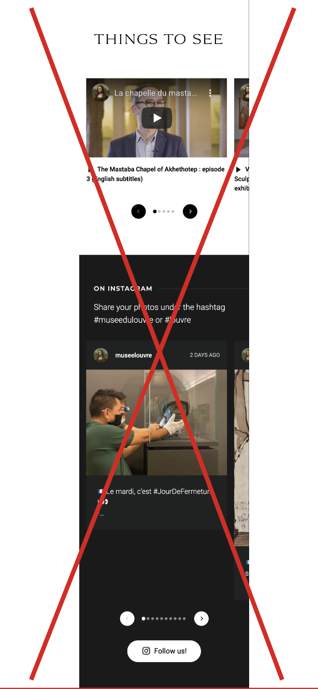
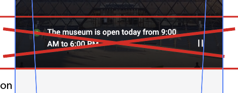

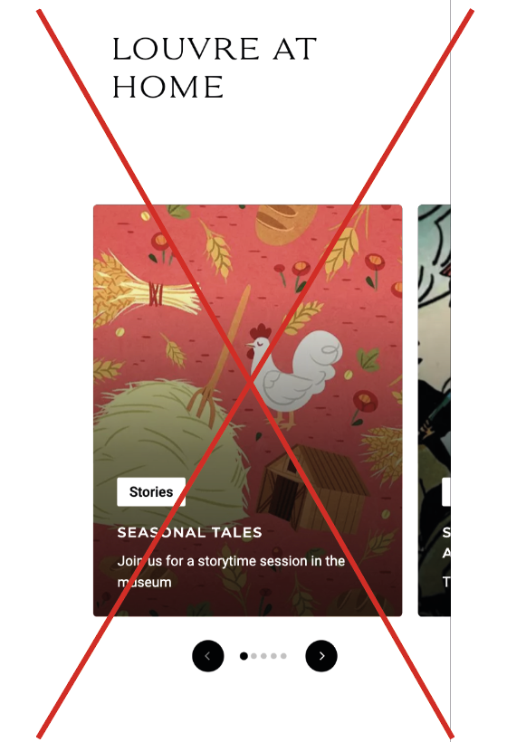
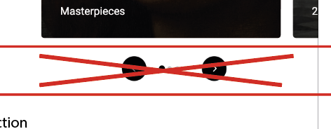

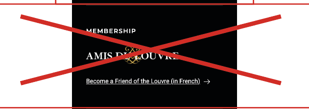

### ongeïnteresseerde onderdelen 2: 
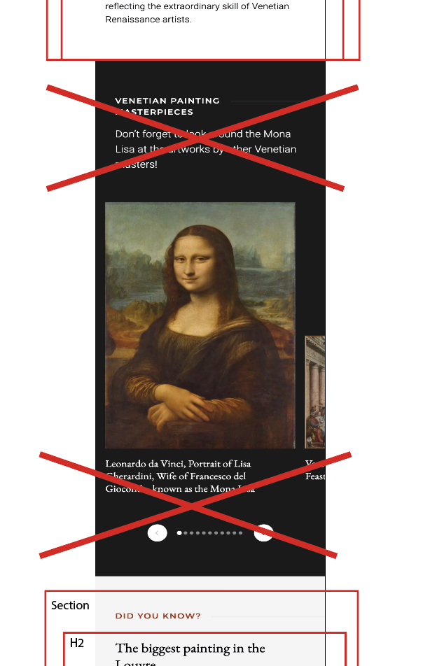
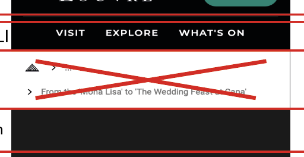

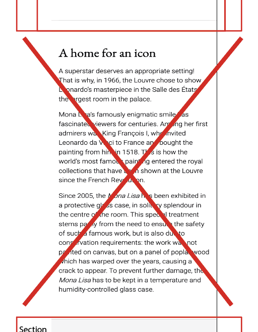

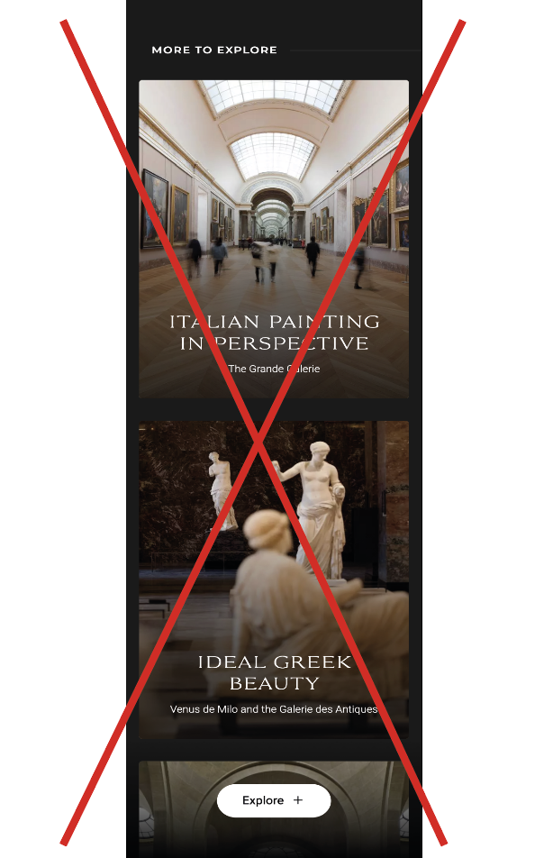

## Huisstijl analyse (week 2)
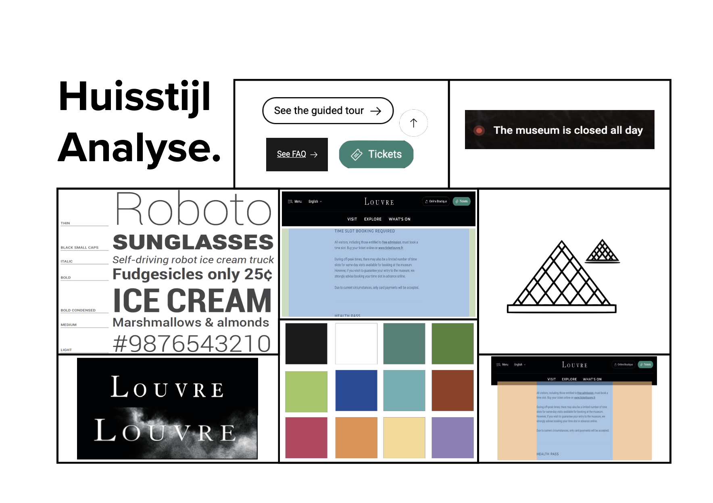

## Voortgang 1 (week 2)

uitwerken voor 1e voortgang

### Stand van zaken
Ik ben deze week begonnen aan de navigatiebalk (de header), hieronder zie je de eerste versie van de navigatiebalk:

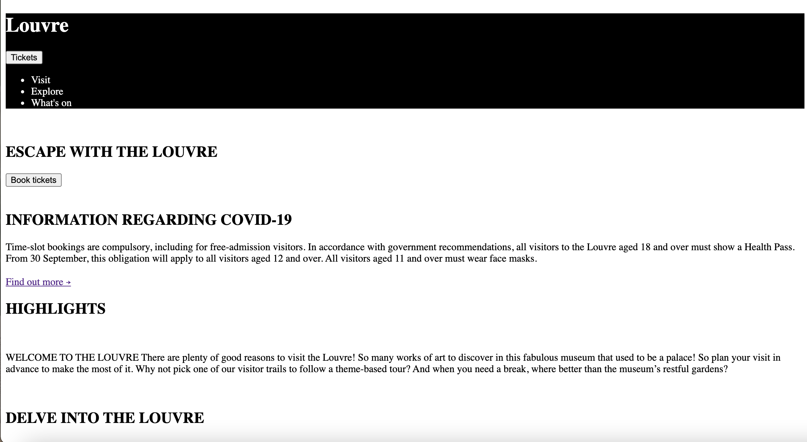
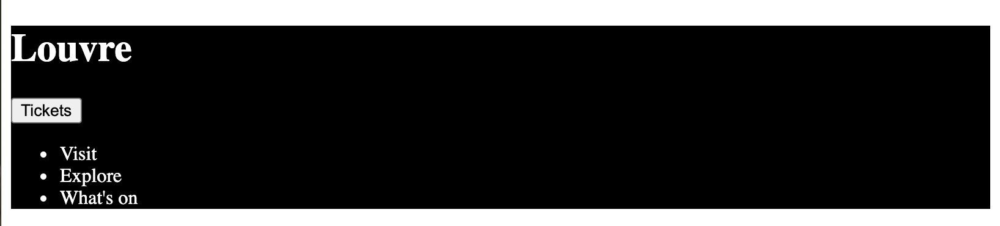

Ik liep op een geven moment wel vast, waardoor ik hulp kreeg van een student assistent en ik heb verder gebruik gemaakt van Youtube. 

Hieronder zie je de 2e versie:
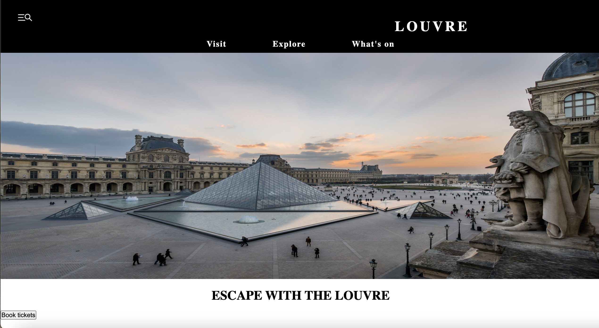
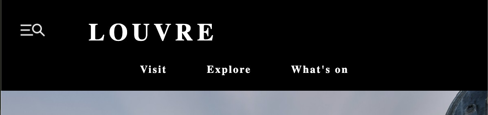

### Agenda voor meeting
samen met je groepje opstellen

| student 1      | student 2          | student 3    | student 4        |
| ---            | ---                | ---          | ---              |
| dit bespreken  | en dit             | en ik dit    | en dan ik dat    |
| en dat ook nog | dit als er tijd is | nog een punt | dit wil ik zeker |
| ...            | ...                | ...          | ...              |

### Verslag van meeting
Vandaag heb ik mijn voortgang gesprek gehad, hier werd de onderstaande punten besproken waar ik aanpassingen in moet gaan doen. 

- Minder classes gebruiken, ipv daarvan nth-of-type () gebruiken
- Hoe de div's worden gebruikt klopt niet, beter ul's gebruiken
- li moet in een ul zitten en kan dus niet alleen zitten

## Voortgang 2 (week 3)

uitwerken voor 2e voortgang

### Stand van zaken
Inmiddels is het gelukt om minder classes te gebruiken, daarvoor heb ik nth-of-type gebruikt:

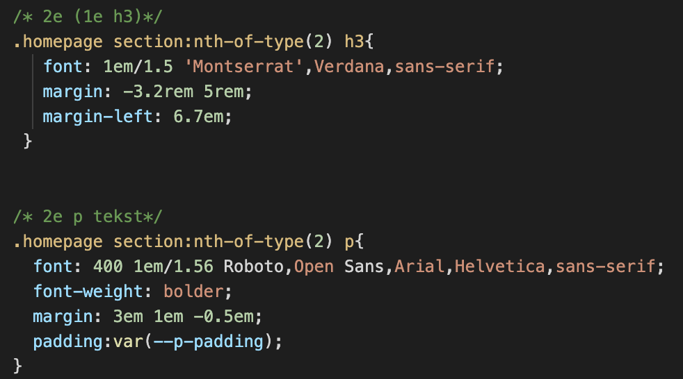

### Agenda voor meeting
samen met je groepje opstellen

| student 1      | student 2          | student 3    | student 4        |
| ---            | ---                | ---          | ---              |
| dit bespreken  | en dit             | en ik dit    | en dan ik dat    |
| en dat ook nog | dit als er tijd is | nog een punt | dit wil ik zeker |
| ...            | ...                | ...          | ...              |

### Verslag van meeting
Vandaag heb ik mijn voortgang gesprek gehad, hier werd de onderstaande punten besproken waar ik aanpassingen in moet gaan doen. 

- html en css code opschonen 
- vaart maken met code schrijven
- Beginnen aan 2e pagina

## Toegankelijkheidstest (week 4)

uitwerken na test in 8e voortgang

### Bevindingen
Lijst met je bevindingen die in de test naar voren kwamen:

#### Titel eerste bevinding
Hier korte omschrijving (met indien nodig een afbeelding)

Hier een omschrijving van hoe het opgelost kan worden (met indien nodig een afbeelding)

#### Titel tweede bevinding. 
Hier korte omschrijving (met indien nodig een afbeelding)

Hier een omschrijving van hoe het opgelost kan worden (met indien nodig een afbeelding)

#### Titel volgende bevinding. 
Hier korte omschrijving (met indien nodig een afbeelding)

Hier een omschrijving van hoe het opgelost kan worden (met indien nodig een afbeelding)

#### Titel nog een bevinding. 
Hier korte omschrijving (met indien nodig een afbeelding)

Hier een omschrijving van hoe het opgelost kan worden (met indien nodig een afbeelding)

## Voortgang 3 (week 4)

uitwerken voor 3e voortgang

### Stand van zaken
hier dit ging goed & dit was lastig (neem ook screenshots op van delen van je website en code)

### Agenda voor meeting
samen met je groepje opstellen

| student 1      | student 2          | student 3    | student 4        |
| ---            | ---                | ---          | ---              |
| dit bespreken  | en dit             | en ik dit    | en dan ik dat    |
| en dat ook nog | dit als er tijd is | nog een punt | dit wil ik zeker |
| ...            | ...                | ...          | ...              |

### Verslag van meeting
hier na afloop snel de uitkomsten van de meeting vastleggen

- Header moet in de body
- Verder werken

## Eindgesprek (week 5)

uitwerken voor eindgesprek

### Stand van zaken
hier dit ging goed & dit was lastig (neem ook screenshots op van delen van je website en code)

### Screenshot(s)

hier screenshot(s) van je eindresultaat

## Bronnenlijst

continu bijhouden terwijl je werkt

Nb. Wees specifiek ('css-tricks' als bron is bijv. niet specifiek genoeg).

1. bron 1
2. bron 2
3. ...

