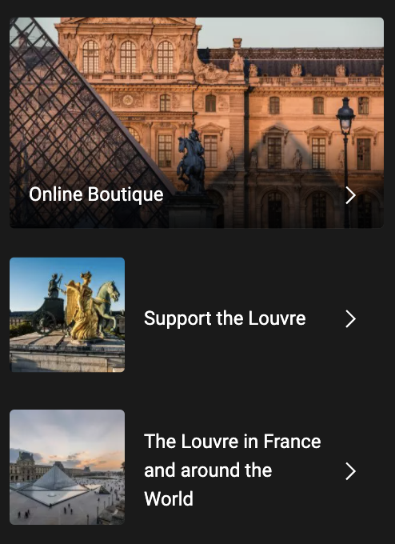

# Procesverslag
Markdown is een simpele manier om HTML te schrijven.  
Markdown cheat cheet: [Hulp bij het schrijven van Markdown](https://github.com/adam-p/markdown-here/wiki/Markdown-Cheatsheet).

Nb. De standaardstructuur en de spartaanse opmaak van de README.md zijn helemaal prima. Het gaat om de inhoud van je procesverslag. Besteedt de tijd voor pracht en praal aan je website.

Nb. Door *open* toe te voegen aan een *details* element kun je deze standaard open zetten. Fijn om dat steeds voor de relevante stuk(ken) te doen.

## Jij

uitwerken voor kick-off werkgroep

### Auteur:
Gloria Kwako 

#### Je startniveau:
Blauwe piste 🗻

#### Je focus:
surface 🕹 🧩
 

## Je website

uitwerken voor kick-off werkgroep

### Je opdracht:
Voor deze opdracht ga ik de bekendste museum "de Louvre" na maken omdat ik afgelopen zomer hier geweest ben en een super leuke tijd had gehad. De reden waarom deze museum mij aansprak is door de Mona Lisa, wat ik al een tijdje wilde gaan zien. De website heeft een mooie layout waar ik goed mee kan werken en heeft ook zijn eigen moeilijkheidsgraad, ben benieuwd hoe dit gaat aflopen...

<a href="https://www.louvre.fr/en">link Louvre</a>

#### Screenshot(s) home-pagina (small screen): 
Hieronder zie je een screenshot van de home page van de website op z'n geheel. 

#### Screenshot(s) mona-lisa-page (small screen):
 Hier is de 2e screenshot, ik heb gekozen om de mona lisa home page na te gaan maken als 2e pagina. 

 

## Breakdownschets (week 1)

uitwerken na afloop 2e werkgroep

### de hele pagina 1 & 2: 
Hier is de volledige pagina te zien op een mobiele formaat.

### breakdown onderdelen: 
Deze pagina's heb ik HTML onderdelen geven om zo het werk makkelijker te verdelen in het programma. 

### ongeïnteresseerde onderdelen 1: 
Deze zijn de onderdelen die ik niet mee gaan nemen.

### ongeïnteresseerde onderdelen 2: 

## Huisstijl analyse (week 2)

## Voortgang 1 (week 2)

uitwerken voor 1e voortgang

### Stand van zaken
Ik ben deze week begonnen aan de navigatiebalk (de header), hieronder zie je de eerste versie van de navigatiebalk:

Ik liep op een geven moment wel vast, waardoor ik hulp kreeg van een student assistent en ook heb ik verder gebruik gemaakt van Youtube. 

Hieronder zie je de 2e versie:

### Verslag van meeting
Vandaag heb ik mijn voortgang gesprek gehad, hier werd de onderstaande punten besproken waar ik aanpassingen op moet gaan doen. 

- Minder classes gebruiken, ipv daarvan nth-of-type () gebruiken
- Hoe de div's worden gebruikt klopt niet, beter ul's gebruiken
- li moet in een ul zitten en kan dus niet alleen zitten

## Voortgang 2 (week 3)

uitwerken voor 2e voortgang

### Stand van zaken
Inmiddels is het gelukt om minder classes te gebruiken, daarvoor heb ik nth-of-type gebruikt:

### Verslag van meeting
Vandaag heb ik mijn voortgang gesprek gehad, hier werd de onderstaande punten besproken waar ik aanpassingen in moet gaan doen. 

- html en css code opschonen 
- vaart maken met code schrijven
- Beginnen aan 2e pagina

## Toegankelijkheidstest (week 4)

uitwerken na test in 8e voortgang

### Bevindingen
Lijst met je bevindingen die in de test naar voren kwamen:

#### Kleurenblindheid
Vanadaag heb ik een aantal brillen uitgeprobeerd dat hetzelfde effect geeft van iemand die kleuren blind is.

Met deze brillen heb ik op mijn eigen website proberen te surfen, dit ging grotendeels wel goed, de website is toegankelijk voor kleuren blinden.

De Louvre gebruikt geen gekke kleuren waardoor het voor de meeste kleurenblinden een fijne website is om te surfen.

#### Elastiek 
Met de elastieken moest je ze om je vingers wikkelen en vervolgens proberen te surfen in je eigem website. 

Dit was wel moeilijk te doen met de trackpad waardoor het fijner is om met de toetsenboard of screen-reader mee te werken. 

#### Screen-reader. 
De screen-reader is een fijne en gemakelijke manier om te surfen op de website, alleen moet je wel goed de screen-reader aanpassen zodat het niet lettelijk alles gaat benoemen die niet van belang is.

#### Schok. 
Dit was wel een van de moeilijkste probleem voor mensen die een soort tik hebben en niet stil kunnen zitten, dit maakt het surfen op internet erg moeilijk. 

De geadviseerde manier om te surfen op internet voor hun is om sirri te gekrijgen, dit zorgt ervoor dat ze niet hoeven te typen.

### Test personen 
samen met je groepje opstellen

Test persoon 1:
De hamburger menu kan niet getapt worden met de toetsenboard.

## Voortgang 3 (week 4)

uitwerken voor 3e voortgang

### Stand van zaken
Ik ben inmiddels begonnen aan mijn 2e pagina wat ook af is, wel loop ik vast met bapaalde schoonheids foutjes wat mij niet lukt om op te lossen.  

### Verslag van meeting
Vandaag heb ik mijn laatset voortgang gesprek voor het eindbeoordeling, hier werd de onderstaande punten besproken waar ik aanpassingen in moet gaan doen. 

- Vaart maken met code schrijven

## Eindgesprek (week 5)

uitwerken voor eindgesprek

### Stand van zaken
Doordat ik deze week ziek was heb ik in een korte tijd heel veel moeten coderen, wat grotendeels gelukt is maar helaas heb ik het niet helemaal af kunnen krijgen.

Hieronder zie je het eindresultaat van de website:

### Screenshot(s) 1e pagina

### Screenshot(s) 2e pagina

## Bronnenlijst

continu bijhouden terwijl je werkt

Nb. Wees specifiek ('css-tricks' als bron is bijv. niet specifiek genoeg).

1. Hamburger menu: bron- 
2. Scroll gallery (regel:554 in css) bron: flexbox oefening 
3. Gallery (regel: 675 in css) bron: https://www.youtube.com/watch?v=zgXHgKad7N0 
4. Formulier (regel: 2e html 171) bron: internetstandaarden
5. Video (regel: 73) bron: https://www.youtube.com/watch?v=05ZHUuQVvJM 

<!--  
<body class="homepage">
	<!-- hier is de hamburger menu (rechts boven) -->
	<header>
		<nav id="menuToggle">
			<ul>
				<li><input type="checkbox" />

					
					
					

					<ul>
						<!-- Bron: https://www.youtube.com/watch?v=UOGvJhvLUg0 -->
						<input class="search" type="text" name="" placeholder="Search...">

						

						<a href="https://www.louvre.fr/en/visit">
							<li>Visit</li>
						</a>
						<a href="https://www.louvre.fr/en/explore">
							<li>Explore</li>
						</a>
						<a href="https://www.louvre.fr/en/what-s-on">
							<li>What's on</li>
						</a>

						

						<a href="https://boutique.louvre.fr/?lang=en">
				</li></a>

				

				<h4>
					
					
					
					
					
					
				</h4>

				<li></li>
			</ul>
			</li>

			<li>
				<ul>
					<li><a href="#">Louvre</a></li>

					

				</ul>

			</li>
			<li>
			<li><button> Tickets </button></li>
			</li>

			</ul>

			<!-- hier is de navigatie menu -->

			<ul>
				<li><a href="https://www.louvre.fr/en/visit">VISIT</a></li>
				<li><a href="https://www.louvre.fr/en/explore">EXPLORE</a></li>
				<li><a href="https://www.louvre.fr/en/what-s-on">WHAT'S ON </a></li>
			</ul>
		</nav>
	</header>
